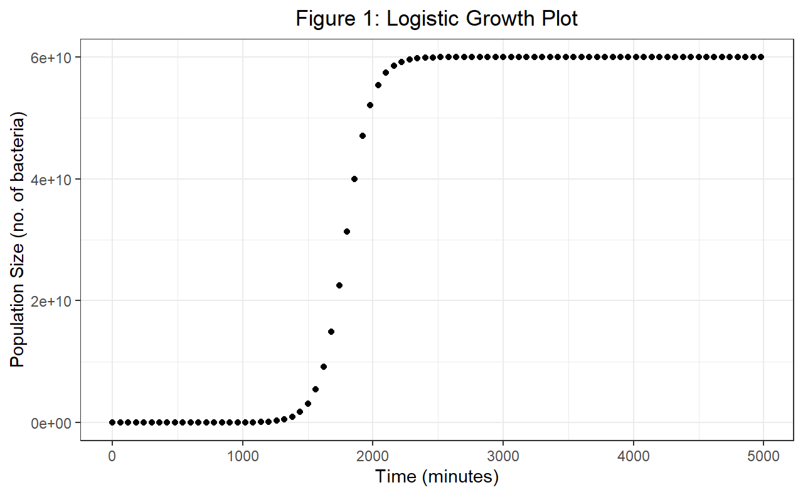
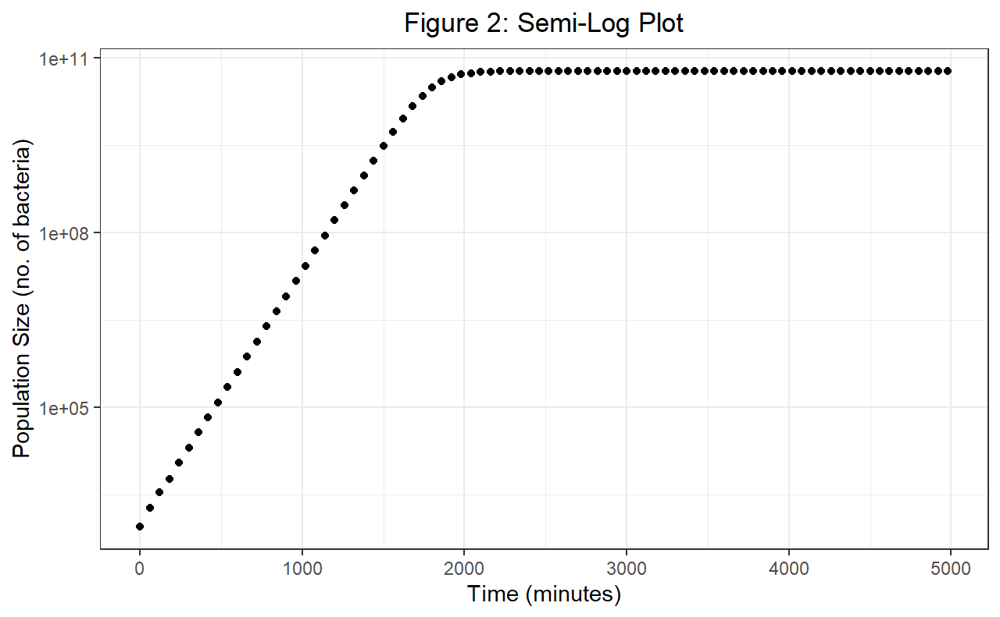
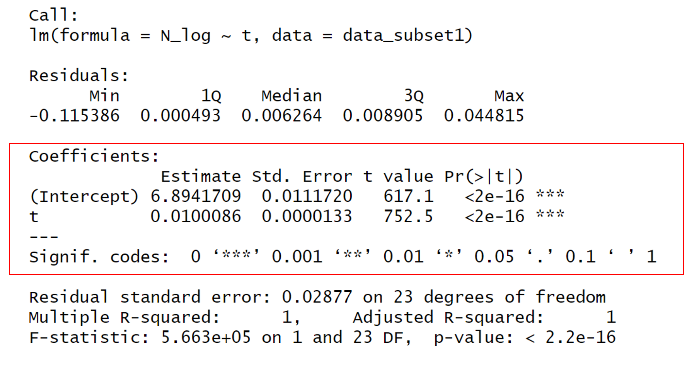
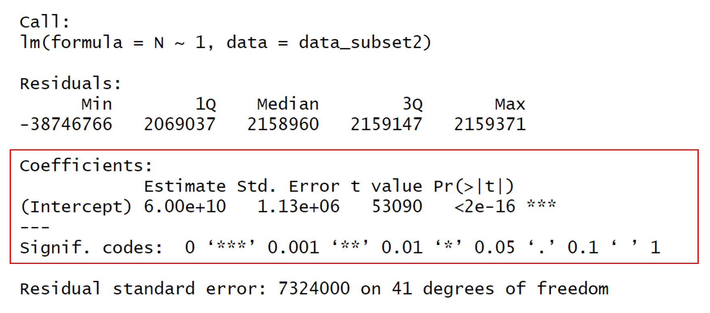
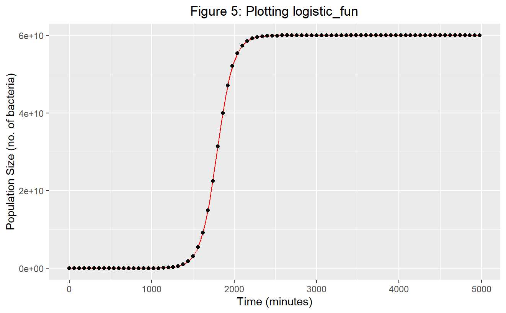
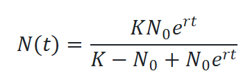
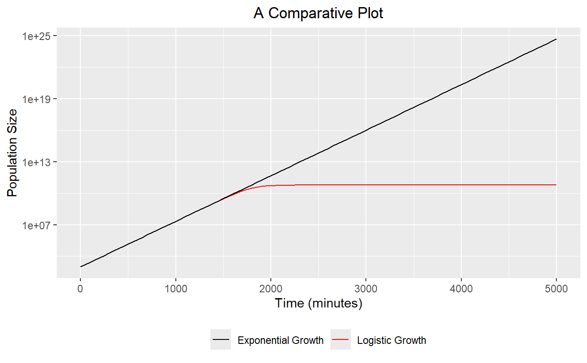
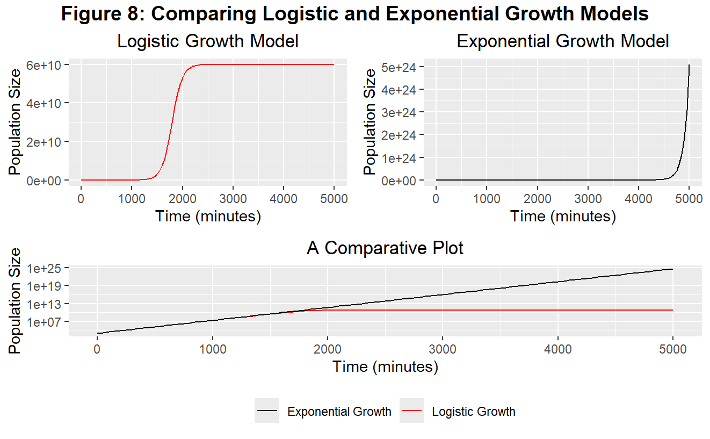

# Logistic Growth

This R markdown file will take the reader through a reproducible analysis of logistic growth.

## Question 1

### Plotting Logistic growth data:

```{r}
install.packages("ggplot2")
library(ggplot2)

growth_data <- read.csv("experiment.csv")

#Plot 1: Logistic Growth Plot
ggplot(aes(t,N), data = growth_data) +
  
  geom_point() +
  
  xlab("Time (minutes)") +
  
  ylab("Population Size (no. of bacteria)") +
  
  theme_bw() +
  
  ggtitle("Figure 1: Logistic Growth Plot") +
  
  theme(plot.title = element_text(hjust = 0.5))

#Plot 2: Semi-Log Plot
ggplot(aes(t,N), data = growth_data) +
  
  geom_point() +
  
  xlab("Time (minutes)") +
  
  ylab("Population Size (no. of bacteria)") +
  
  scale_y_continuous(trans='log10') +
  
  theme_bw() +
  
  ggtitle("Figure 2: Semi-Log Plot") +
  
  theme(plot.title = element_text(hjust = 0.5))
  
```

The script in the above R chunk was the first script that was run. This script (that I have adjusted slightly to produce higher quality plots) allowed us to plot the data from experiment.csv in two different ways:

The first way involved plotting the number of bacteria (N) against time (t). This was done using the ggplot2 package (see Figure 1). The result is the classic logistic model of population growth (where a maximum carrying capacity is eventually reached due to the resources becoming limited within the environment).

Having done this, we then produced a semi-log plot (with the x-axis being linear, and the y-axis being log-transformed - see figure 2). This plot showed that at certain early time points (until approximately t=900), growth rate was linear (and therefore on a log transformed scale was exponential). It also showed that this was then followed by a period of constant population size at later time points (after approximately t=2500). It was important that we produced this plot, in order to help us carry out our linear model analysis later on.



### Fitting Linear Models:

```{r}
library(dplyr)

growth_data <- read.csv("experiment.csv")

#Case 1. K >> N0, t is small

data_subset1 <- growth_data %>% filter(t<1500) %>% mutate(N_log = log(N))

model1 <- lm(N_log ~ t, data_subset1)
summary(model1)

#Case 2. N(t) = K

data_subset2 <- growth_data %>% filter(t>2500)

model2 <- lm(N ~ 1, data_subset2)
summary(model2)
```

In this section, we used the script in the above R chunk to fit different linear models to different parts of the semi-logged data that we saw above. The first case was when K \>\> N0, and t was small. In this first case, we used the dplyr package to filter the data set to time-points below t = 1500, to ensure that we only captured the period of exponential growth. The second case was when N(t) = K, and in this instance we used the dplyr package to filter the data-set to time-points above t = 2500, to ensure that we captured the population at carrying capacity. Having created our two data subsets, we then produced linear models for both, by using the lm() function. With the linear models successfully fitted to our data subsets, we then used the summary function to view estimates for the slope and intercept values, as well as their associated statistical information. These data are fully explored in the results section below.

### Plotting our Models:

In this section we generated our own logistic curve, using the script in the below R chunk to generate the function 'logistic_fun'. This function allowed us to change the parameters N0, r, and K (which we estimated from our linear models as detailed in the results section), and see how well our model fit (in red) onto the plotted data from the original experiment.csv file. Here, we were essentially seeing how well our model approximation fit onto the actual data (see Figure 5).

```{r}
logistic_fun <- function(t) {
  
  N <- (N0*K*exp(r*t))/(K-N0+N0*exp(r*t))
  
  return(N)
  
}

N0 <- 982.401417 #Our estimate for initial population size
  
r <- 0.0100086 #Our estimate for the growth rate
  
K <- 60000000000 #Our estimate for the carrying capacity

ggplot(aes(t,N), data = growth_data) +
  
  geom_function(fun=logistic_fun, colour="red") +
  
  geom_point() +
  
  xlab("Time (minutes)") +
  
  ylab("Population Size (no. of bacteria)") +
       
  ggtitle("Figure 5: Plotting logistic_fun") +
  
  theme(plot.title = element_text(hjust = 0.5))
```

### Results:

In order to carry out our analyses (on the experiment.csv file), we created a linear approximation for the following logistic equation:

N(t) = N0e\^(rt)

This linear approximation was achieved by performing a log transformation, to get our equation in the form y = c + mx.

ln(N(t)) = ln(N0e\^(rt))

ln(N) = ln(N0) + rtln(e)

ln(N) = ln(N0) + rt

We considered two cases as detailed in the above 'fitting linear models' section.

#### Case 1: K \>\> N0 and t is small

In this case ln(N) = ln(N0) + rt.

The estimate for the intercept (ln(N0)) is equal to approximately 6.89. Therefore our approximation for N0 is equal to e\^6.89 which is approximately 982. The estimate for the gradient (r) is equal to 0.01. Therefore our approximation for r is 0.01.

#### **Figure 3: Output from summary(model1)**



#### Case 2: t is large, and N(t) = K+0\*t

N(t) = K + 0\*t

N(t) = K

Therefore our estimate for K is 6.00e+10.

#### **Figure 4: Output from summary(model2)**



#### Estimates for parameters:

N0 = 982

r = 0.01

K = 6.00e+10

#### Using logistic_fun with our estimated parameters (Results from the 'Plotting our Models section):

An excellent fit of our model is evidenced on the below plot, where the function logistic_fun was plotted on top of our original dataset.



## Question 2

Calculating the population size at t=4980 minutes:

Assuming that the population grows exponentially, I have to substitute my estimated values of N0 and r into the following equation:

N(t) = N0e\^(rt)

By my estimates:

N0 = 982

r = 0.01

Therefore:

N(t=4980) = 982\*e\^(0.01\*4980)

N(t=4980) = 4.17e+24

Therefore, assuming the population grows exponentially, the population size at t=4980 minutes is 4.17e+24

#### Comparing this value to the population size predicted under logistic growth

Under the logistic growth model, the population size at t=4980 minutes is 6.00e+10

#### **Figure 6: The Logistic Growth Equation**



Therefore:

(4.17e+24)/(6.00e+10) = 6.95e+13

The population size at time t=4980 is therefore 6.95e+13 times bigger when using the exponential growth model instead of the logistic growth model.

The population size predicted by the exponential growth model is therefore many orders bigger than that predicted by the logistic growth model, at t = 4980 minutes.

## Question 3

Adding an R script to make a graph comparing the exponential and logistic growth curves.

```{r}
install.packages("ggplot2")
library(ggplot2)

growth_data <- read.csv("experiment.csv")

#Below are the parameters that will be substituted into both functions which are being plotted

N0 <- 982 #This is the initial population size
r <- 0.01 #This is the growth rate
t <- seq(0, 5000, by = 0.1) #This will give me the sequence of t values that are being inputted into the function

#Plotting the logistic growth curve
logistic_growth_plot <- ggplot() +
  
  geom_function(fun=logistic_fun, colour="red") +
  
  geom_point() +
  
  xlim(0, 5000) +
  
  xlab("Time (minutes)") +
  
  ylab("Population Size") +
       
  ggtitle("Logistic Growth Model") +
  
  theme(plot.title = element_text(hjust = 0.5))


#Plotting the exponential growth curve involves first generating a function for exponential growth

exponential_growth <- function(t) {
  
  Nt <- N0*exp(r*t)
  
  return(Nt)
  
}

#Plotting exponential growth

exponential_growth_plot <- ggplot() +
  
  geom_function(fun=exponential_growth, colour = "black") +
  
  xlim(0, 5000) +
  
  xlab("Time (minutes)") +
  
  ylab("Population Size") +
  
  ggtitle("Exponential Growth Model") +
  
  theme(plot.title = element_text(hjust = 0.5)) 
 
  
  

#It would be more useful to have the functions plotted on top of each other for easier comparisons, using a log transformed y axis.


Combined_plot <- ggplot() +
  
  geom_function(aes(color = "Logistic Growth"), fun=logistic_fun) +
  
  geom_function(aes(color = "Exponential Growth"), fun=exponential_growth) +
  
  xlim(0, 5000) +
  
  scale_y_continuous(trans='log10') + 
    
  xlab("Time (minutes)") +
  
  ylab("Population Size") +
  
  ggtitle("A Comparative Plot") +
  
  scale_color_manual(values = c("Logistic Growth" = "red", 
                                "Exponential Growth" = "black")) +
  
    theme(plot.title = element_text(hjust = 0.5),
        legend.title = element_blank(),  
        legend.position = "bottom")

#Finally I will show all of these graphs next to each other 
#Using the gridExtra package
install.packages("gridExtra")
install.packages("grid")
library(gridExtra)
library(grid)
grid.arrange(
  logistic_growth_plot, exponential_growth_plot,                
  Combined_plot,                    
  layout_matrix = rbind(c(1,2),   
                        c(3)), top = textGrob("Figure 8: Comparing Logistic and Exponential Growth Models", gp = gpar(fontsize = 14, fontface = "bold"))
)
```





```{r}
#In this chunk of R code I am ensuring that I keep a copy of all the required packages to run this code, in order to allow for reproducibility

sink(file = "package-versions.txt")
sessionInfo()
sink()
```

With the analysis complete, I have now created a list of all the packages required to run this code, in order to ensure that someone else could easily reproduce my work.
