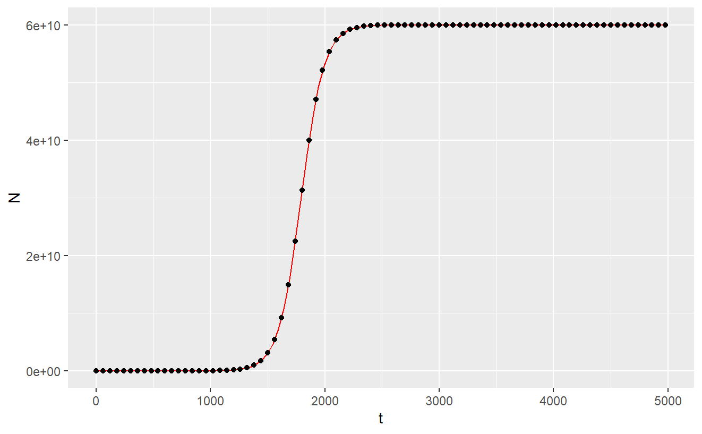

# Logistic Growth

R scripts for a reproducible analysis of logistic growth

## Question 1

#### Plotting the logistic growth data

```{r}
install.packages("ggplot2")
library(ggplot2)

growth_data <- read.csv("experiment.csv")

#Plot 1
ggplot(aes(t,N), data = growth_data) +
  
  geom_point() +
  
  xlab("t") +
  
  ylab("y") +
  
  theme_bw()

#Plot 2
ggplot(aes(t,N), data = growth_data) +
  
  geom_point() +
  
  xlab("t") +
  
  ylab("y") +
  
  scale_y_continuous(trans='log10') +
  
  theme_bw()
```

This was the first script that was run. Here we plotted the data from experiment.csv (a simulated experiment) in two different ways.

The first way involved plotting the number of bacteria (N) against time (t). This was done using the ggplot2 package. (See below). The result is the classic logistic model of population growth, where a maximum carrying capacity is eventually reached.

Having done this, we then produced a semi-log plot (with the x-axis being linear, and the y-axis being log-transformed). This demonstrated that at certain early time points, growth was linear (and therefore on a log transformed scale was exponential). It also showed that this was then followed by a period of constant population size at later time points (after approximately t=2500). It was important that we produced this plot, in order to help us carry out our linear model analysis later on.


#### Fitting Linear Models

```{r}
library(dplyr)

growth_data <- read.csv("experiment.csv")

#Case 1. K >> N0, t is small

data_subset1 <- growth_data %>% filter(t<1500) %>% mutate(N_log = log(N))

model1 <- lm(N_log ~ t, data_subset1)
summary(model1)

#Case 2. N(t) = K

data_subset2 <- growth_data %>% filter(t>2500)

model2 <- lm(N ~ 1, data_subset2)
summary(model2)
```

In this section, we used the above script to fit different linear models to different parts of the semi-logged data set that we saw above. The first case was when K \>\> N0, and t was small. In this first case, we used the dplyr package to filter the data set to time-points below t = 1500, to ensure that we only captured the period of exponential growth. The second case was when N(t) = K, and in this instance we used the dplyr package to filter the data-set to time-points above t = 2500, to ensure that we captured the population at carrying capacity. Having created our two data subsets, we then produced linear models for both, by using the lm() function. With the linear models successfully fitted to our data subsets, we then used the summary function to access estimates for slope and intercept, as well as associated statistical information. These data are fully explored in the results section below.

#### Plotting our Models.

In this section we generated our own logistic curve, using the below script to generate the function 'logistic_fun'. This function allowed us to change the parameters N0, r and K (which we estimated from our linear models above as detailed in the results section), and see how well our model fit (in red) onto the plotted data from the original experiment.csv file. Here, we were essentially seeing how well our model approximation fit onto the actual data.

```{r}
logistic_fun <- function(t) {
  
  N <- (N0*K*exp(r*t))/(K-N0+N0*exp(r*t))
  
  return(N)
  
}

N0 <- 982.401417 #
  
r <- 0.0100086 #
  
K <- 60000000000 #

ggplot(aes(t,N), data = growth_data) +
  
  geom_function(fun=logistic_fun, colour="red") +
  
  geom_point()

  #scale_y_continuous(trans='log10')
```

#### Results

In order to carry out our analyses (on the experiment.csv file), we created a linear approximation for the following logistic equation:

N(t) = N0e\^(rt)

This linear approximation was achieved by performing a log transformation, to get our equation in the form y = c + mx.

ln(N(t)) = ln(N0e\^(rt))

ln(N) = ln(N0) + rtln(e)

ln(N) = ln(N0) + rt

We considered two cases as detailed in the above 'fitting linear models' section.

#### Case 1: K \>\> N0 and t is small

In this case ln(N) = ln(N0) + rt.

The estimate for the intercept (ln(N0)) is equal to approximately 6.89. Therefore our approximation for N0 is equal to e\^6.89 which is approximately 982. The estimate for the gradient (r) is equal to 0.01. Therefore our approximation for r is 0.01.


#### Case 2: t is large, and N(t) = K+0\*t

N(t) = K + 0\*t

N(t) = K

Therefore our estimate for K is 6.00e+10.


#### Estimates for parameters:

N0 = 982

r = 0.01

K = 6.00e+10

#### Using logistic_fun with our estimated parameters:

An excellent fit of our model is evidenced on the below plot, where the function logistic_fun was used to plot the red line superimposed on our original dataset.



## Question 2

Calculating the population size at t=4980 minutes

Assuming that the population grows exponentially means substituting my values of N0, r and K into the following equation:

N(t) = N0e\^(rt)

By my estimates:

N0 = 982

r = 0.01

Therefore:

N(t=4980) = 982\*e\^(0.01\*4980)

N(t=4980) = 4.17e+24

Therefore, assuming the population grows exponentially, the population size at t=4980 minutes is 4.17e+24

#### Comparing this value to the population size predicted under logistic growth

Under the logistic growth model, the population size at t=4980 minutes is 6.00e+10

(The logistic model equation):


Therefore, the population size at time t=4980 is (4.17e+24)/(6.00e+10) times bigger (6.95e+13 times bigger).

The population size predicted by exponential growth is therefore many orders bigger than that predicted by logistic growth, at t = 4980 minutes).

## Question 3

Adding an R script to make a graph comparing the exponential and logistic growth curves.

```{r}
install.packages("ggplot2")
library(ggplot2)

growth_data <- read.csv("experiment.csv")

#Plotting the logistic growth curve
logistic_growth_plot <- ggplot(aes(t,N), data = growth_data) +
  
  geom_point() +
  
  xlab("Time (minutes)") +
  
  ylab("Population Size") +
  ggtitle("Logistic Growth")


#Plotting the exponential growth curve 
#N(t) = N0e^(rt)
#Defining my parameters (I have ended the curve at the same point of t=5000).

N0 <- 982 #This is the initial population size
r <- 0.01 #This is the growth rate
t <- seq(0, 5000, by = 0.1) #This will give me the sequence of t values that are being calculated from the equation

#Calculating my Nt values

Nt <- N0*exp(r*t)

#Creating a function for exponential growth

exponential_growth <- function(t) {
  
  Nt <- N0*exp(r*t)
  
  return(Nt)
  
}


N0 <- 982 #This is the initial population size
r <- 0.01 #This is the growth rate
t <- seq(0, 5000, by = 0.1) #This will give me the sequence of t values that are being calculated from the equation

#Storing the output values from my function (with 't' input values)

Exponential_size <- exponential_growth(t)

#Creating a data frame

Exponential_df <- data.frame(
  x = t,
  y = Exponential_size
)

exponential_growth_plot <- ggplot(aes(t,Nt), data = Exponential_df) +
  
  geom_point() +
  
  xlab("Time (minutes)") +
  
  ylab("Population Size") +
  ggtitle("Exponential Growth")

#It will be more useful to compare these plots side by side.
#Using the gridExtra package

grid.arrange(logistic_growth_plot, exponential_growth_plot, ncol = 2)

```


(Graph will need cleaned up)
